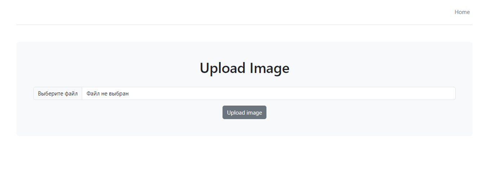
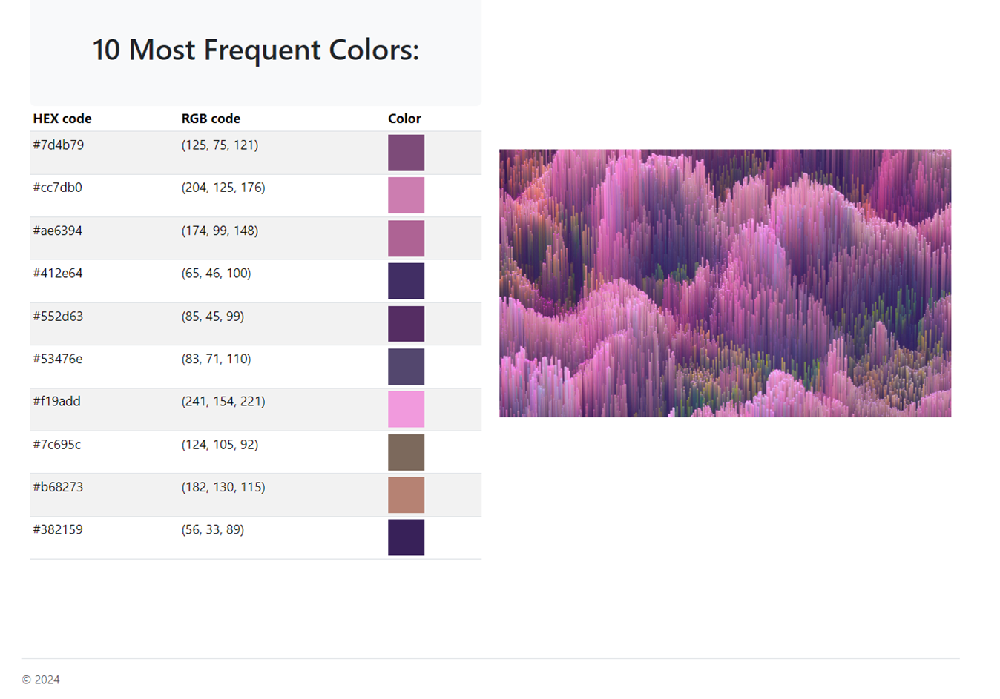

## Color Extractor
Color Extractor is a web application that allows users to upload an image and extract the 10 most frequent colors from it. The app provides the HEX and RGB codes for the extracted colors, along with a color preview.

### Features
- Upload an image in JPG, JPEG, PNG, or GIF format.
- Extract the 10 most frequent colors from the image using the Colorgram library.
- View the extracted colors as HEX and RGB codes.
- Visual color preview for each extracted color.

## Technologies Used
- Flask: Python-based web framework to manage the backend.
- Flask-Bootstrap: Used for integrating Bootstrap to handle front-end styling.
- WTForms: For handling file upload forms.
- Colorgram: Library to extract colors from images.
- Pillow: Image processing library used to open and manipulate images.

## Installation
1. Clone the repository:  
`git clone https://github.com/Tais19991/Web-Development/edit/main/Color_Extractor)`   
`cd Color_Extractor`  

2. Create a virtual environment:  
`python -m venv venv`  
`source venv/bin/activate`  (# On Windows: `venv\Scripts\activate`)  

3. Install the required packages:    
`pip install -r requirements.txt`      

4. Set up environment variables:   
You need to set any MARKET_APP_KEY for the app to run.  
On Linux or macOS: `export MARKET_APP_KEY='your_secret_key'`  
On Windows: `set MARKET_APP_KEY='your_secret_key'`  

5. Run the Flask app:  
`flask run`   
Open your browser and visit http://127.0.0.1:5000/ to use the application.  

### Usage
Upload an image by clicking on the "Upload Image" button.  
Once uploaded, the app will display the extracted colors in both HEX and RGB formats, along with a visual preview of each color.  

#### Example
Here's an example of how the application looks after uploading an image:  

### License
This project is licensed under the MIT License.

