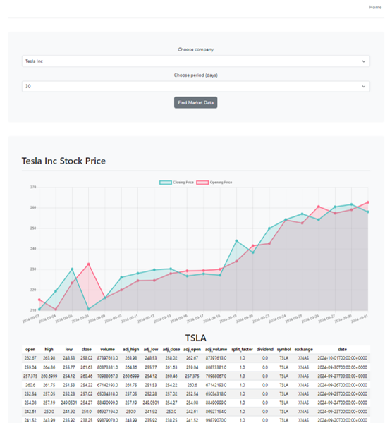

# Stock Market Dashboard

This is a web-based Stock Market Dashboard built with Flask, Chart.js, and Bootstrap. It allows users to visualize stock data, such as opening and closing prices, for selected companies over a specified period.

## Features
- **Interactive Line Chart:** Displays the stock's opening and closing prices using Chart.js.
- **Dynamic Data Selection:** Users can select a company and the time period to fetch stock data from the [MarketStack API](https://marketstack.com/).
- **Responsive UI:** Designed using Bootstrap for mobile and desktop compatibility.
- **Table View:** Displays the detailed stock data in a tabular format below the chart.

## Technology Stack
- **Backend:** Flask
- **Frontend:** Bootstrap, Chart.js, HTML, and JavaScript
- **API:** MarketStack API
- **Forms:** Flask-WTF

## How It Works
1. The user selects a company and the desired time period (in days) from the dropdown menu.
2. The Flask app fetches the stock data using the MarketStack API.
3. The opening and closing prices are visualized on a line chart.
4. Detailed data is also shown in a table below the chart.

## Installation

1. Clone the repository:

    ```bash
    git clone https://github.com/yourusername/stock-market-dashboard.git
    cd stock-market-dashboard
    ```

2. Create and activate a virtual environment:

    ```bash
    python -m venv venv
    source venv/bin/activate  # On Windows: venv\Scripts\activate
    ```

3. Install the required dependencies:

    ```bash
    pip install -r requirements.txt
    ```

4. Set up environment variables for the API:

    Create a `.env` file in the root directory and add your Environment Variables:

    ```
    Flask configuration
    `FLASK_SECRET_KEY=your_secret_key_here`

    MarketStack API configuration
   `MARKETSTACK_API_KEY=your_marketstack_api_key_here`
   `MARKETSTACK_URL=https://api.marketstack.com/v1/`
    ```

5. Run the Flask application:

    ```bash
    flask run
    ```

6. Open your browser and visit `http://127.0.0.1:5000/`.

## Usage
1. On the homepage, select a company and a period (number of days).
2. Click the **Find Market Data** button.
3. The chart will display the opening and closing stock prices for the chosen company over the selected time period.
4. The table below the chart shows the raw data.

## Example



## Project Structure
## API Information
The app uses the [MarketStack API](https://marketstack.com/) to retrieve stock market data. You will need to sign up for an API key to use this service.

## Acknowledgements
- [Flask](https://flask.palletsprojects.com/)
- [Bootstrap](https://getbootstrap.com/)
- [Chart.js](https://www.chartjs.org/)
- [MarketStack API](https://marketstack.com/)

## License
This project is licensed under the MIT License